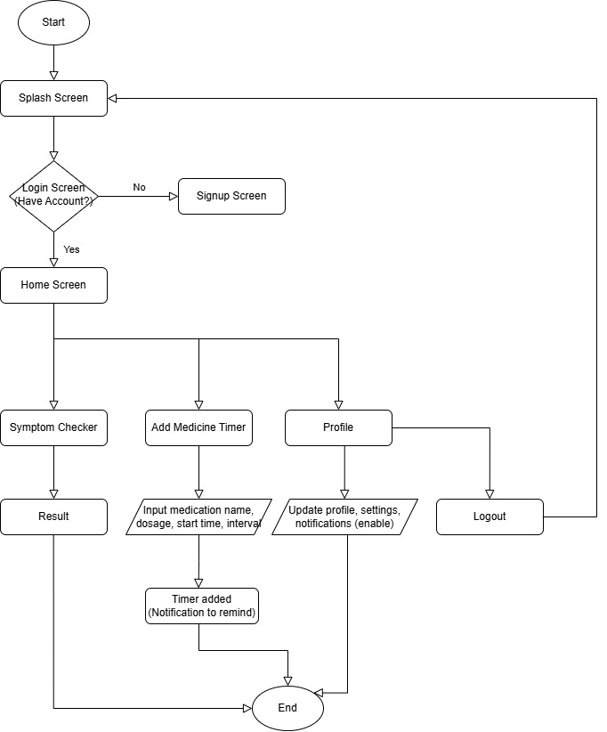
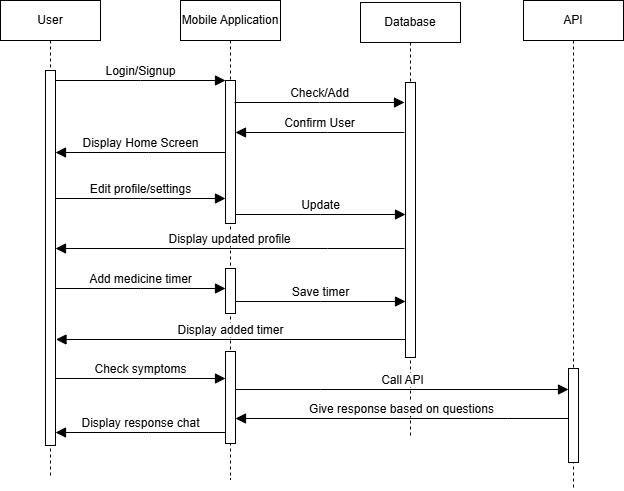
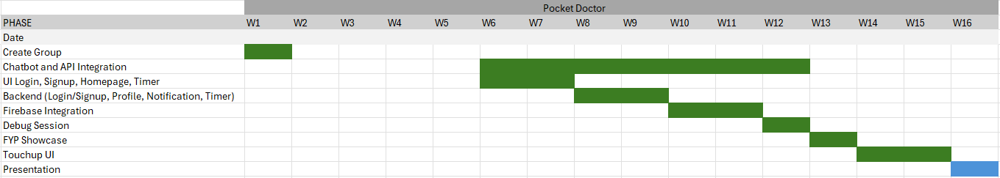

# PocketDoctor – CSCI 4311 Group Project

## 1. Project Information

### 1.1 Group Name
Group Name: United 

### 1.2 Group Members

| No. | Name                     | Matric No.  | Role in Project                      |
|-----|--------------------------|-------------|--------------------------------------|
| 1   | MUHAMMAD AFIQ HAMIZAN BIN HAMDAN | 2218411 | Group Leader, Backend Integration, UI/UX, Chatbot Module|
| 2   | MUHAMMAD IMRAN BIN MUHAMMAD ALI | 2214599 | UI/UX, Backend Integration, Medicine Reminder Module |         |
| 3   | MUHAMMAD ANAZ NAZREE BIN SAHIDIN | 2215777 |Home and Profile Module (home_existing_user, home_new_user, profile_page, my_account_page, setting_page, notification_page, help_support_page, terms_page, language_page) |
| 4   | MOHAMMAD SAIFUL EZLAN BIN SALAMAT | 2221095 | Login Module  | ( login_page, signup_page, welcome_page, logic_page, loading_page) |

## 2. Project Initiation & Ideation

### 2.1 Title

**Project Title:** PocketDoctor – AI-Assisted Symptom Checker & Health Companion

### 2.2 Background of the Problem

Many people search for health information online when they feel unwell, but the information is often confusing, unreliable, and may cause unnecessary panic. Clinics are also commonly overloaded with patients who are unsure whether their symptoms are serious or not. There is a need for a simple mobile application that can help users:

- Understand their symptoms in a structured way  
- Decide whether they should seek medical attention
- Include timer for taking medicine (reminder) 

Mobile phones are almost always with the user, making them suitable platforms for a quick and guided symptom check, reminders, and basic health tracking.

### 2.3 Purpose / Objectives

The main objectives of **PocketDoctor** are:

1. Help users describe and understand their symptoms in an easy way using chatbot.  
2. Provide preliminary AI-assisted health information while reminding users that this is not a replacement for real doctors.   
3. Offer login and authentication for personalized usage and secure access to health records.  
4. Provide an intuitive, user-friendly Flutter app that works smoothly on common Android smartphones.

### 2.4 Target Users

- **Primary Users:** General public (teenagers to adults) who want quick, trustworthy symptom guidance.  
- **Secondary Users:**  
  - Patients preparing for clinic visits

### 2.5 Preferred Platform

**Mobile Platform:** Android (Flutter)  
PocketDoctor will be created as an Android mobile based application since the Android smartphones are popular among students and the general population. Application development using Android will guarantee increased accessibility and easy rollout to the target consumers.

**Framework:** Flutter (Dart)
The app will be developed based on Flutter, a cross-platform user interface platform that uses Dart programming language. Flutter is selected due to being fast to develop, uniform interface, and smooth across Android devices and screen sizes. Its architectural format by virtue of being a widget also assists in designing a clean, user intuitive and responsive user interface, which is vital in health related apps.

**Back End as a Service (BaaS):** Firebase(for authentication & storage)
In case of backend services, Firebase (Backend as a Service -BaaS) will be used. Firebase offers vital functions like user authentication, data storage in a cloud database and a secure data manipulation that do not necessitate the administration of a dedicated server. This will be appropriate when doing student projects and can be expanded to further improvements.

### 2.6 Key Features & Functionalities

Planned core features:

1. **User Authentication**
   - Email & password registration and login
   - Secure session handling and logout

2. **Symptom Checker / Chatbot**
   - Chat-style interface to ask about symptoms (e.g. location, duration, severity)
   - Calls to a health/symptom API 
   - Clear disclaimer that results are not a diagnosis

3. **Medicine / Reminder Module**
   - Users can set reminders for medication or follow-up
   - Local notifications from the device

4. **Profile Screen**
   - View basic profile details
   - Manage personal settings and preferences

5. **General App Features**
   - Responsive layout for common phone sizes
   - Error handling and input validation on forms

## 3. Technologies & Architecture

### 3.1 Tech Stack

- **Frontend:** Flutter (Dart)
- **Backend / BaaS:** Firebase
  - Authentication
  - Cloud database for CRUD (symptom history, user settings, etc.)
- **Packages / Plugins (Examples)**
  - `firebase_auth` client
  - `cloud_firestore` / database plugin
  - `http` for API calls (e.g. symptom/health APIs)
  - `provider`, `riverpod`, or `bloc` for state management
  - `flutter_local_notifications` (for reminders)
  - `timezone` for timezone database (crucial to remind at the correct time)

### 3.2 High-Level Architecture

- **Presentation Layer:** Flutter screens and widgets (Home, Login, Signup, Symptom Checker, Medicine Timer Profile)  
- **Logic Layer:**  
  - State management for user session and symptom flows  
  - Controllers/services for API calls and CRUD operations  
- **Data Layer:**  
  - BaaS Authentication (Firebase/Auth)  
  - Cloud database collections for users and timer 

## 4. Requirement Analysis & Planning

### 4.1 Technical Feasibility & Back-End Assessment

- App will run on **Android smartphones** using Flutter’s rendering engine.
- BaaS (Firebase) supports:
  - Authentication: email/password
  - Real-time or document-based storage (user records)
- CRUD Operations:
  - **Create**: Store new medicine timer records  
  - **Read**: Retrieve past sessions and user profile  
  - **Update**: Edit user profile, update session notes  
  - **Delete**: Delete a session record  

Compatibility considerations:

- Designed for current Android used by students (e.g. Android 10+).  
- Network access required for authentication & API calls.  
- Some limited offline functionality can be considered (e.g. local cache of last results).

### 4.2 Logical Design 

#### 4.2.1 Screen Navigation Flow 

  

#### 4.2.2 Sequence Diagram

  

### 4.3 Gantt Chart

  

## 5. References

1. Anthropic. (2026). Claude 3.5 [Large language model]. https://www.anthropic.com
(Used for implementing the if-else statement to check for existing reminders for the current date).

2. Google. (2026). Gemini (Jan 28 version) [Large language model]. https://gemini.google.com
(Used for UI performance optimization by defining and setting consistent color constants across the application).

3. OpenAI. (2026, January 27). ChatGPT [Large language model]. https://chat.openai.com
(Used for the technical implementation of loading user display names and profile data from the Firebase database).

4. OpenAI. (2026, January 26). ChatGPT [Large language model]. https://chat.openai.com
(Used for the development of the _showGenderPicker logic using a modal bottom sheet).

5. OpenAI. (2026, January 26). ChatGPT [Large language model]. https://chat.openai.com
(Used for the development of the _selectDateOfBirth method using the Flutter showDatePicker interactive dialog).

6. OpenAI. (2026, January 27). ChatGPT [Large language model]. https://chat.openai.com
(Used for implementing the data synchronization logic to save and persist profile updates to the Firebase Realtime Database).

7. Google. (2026). Gemini (Jan 28 version) [Large language model]. https://gemini.google.com
(Used for code optimization through the implementation of modular builder methods for UI components).

8. OpenAI. (2026, January 27). ChatGPT [Large language model]. https://chat.openai.com
(Used for the development of the secure _performLogout function and session termination logic).
